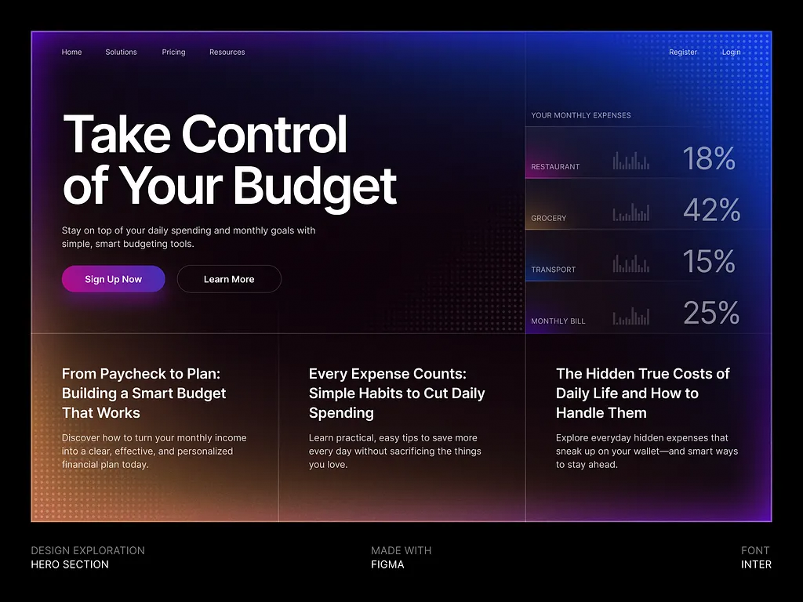

# DPI (Decentralized Public Infrastructure) ⚡

> **Tagline:** Privacy like crypto. Simplicity like UPI.

A next-generation decentralized identity, payment routing, and handle registry Web3 application built on Solana. DPI allows users to send and receive SOL and SPL tokens using human-readable `@handles` (e.g., `@alex`, `@satoshi`) instead of complex 44-character base58 wallet addresses.



---

## 🚀 Key Features

* **🪪 Universal @Handle Checker & Registry**:
  - Real-time availability checker for any handle—whether you already own a handle, use a different wallet, or are disconnected.
  - 1-wallet-to-1-handle on-chain self-sovereign identity mapped via ReverseLookup PDA.
  - 1-click handle claiming with live transaction stepper guidance.
  - Handle ownership transfer modal with on-chain PDA migration.

* **💸 Instant Multi-Token Payments**:
  - Send native **SOL** and Devnet SPL stablecoins (**USDC**, **EURC**, **PYUSD**) with automatic Associated Token Account (ATA) creation.
  - Integrated live camera **QR Code Scanner** with `solana:` URI protocol parsing.
  - **Recent Contacts** carousel chips with 1-click quick pay and removal.
  - Export beautiful, downloadable **PNG Payment Receipts**.

* **⚡ Zero-Lag Caching Architecture**:
  - In-memory TTL cache (`lib/dpi-cache.ts`) for handle and reverse PDA queries with automated cache invalidation upon registration and transfers.
  - Instantaneous tab switching and route navigation across the app without RPC stutter.

* **🧾 Transaction History & Receipts**:
  - Parallel non-blocking transaction parsing with automatic counterparty handle resolution.
  - Search transaction activity by `@handle`, address, or signature.
  - 1-click PNG receipt download and Solana Explorer links.

* **🌐 Public Vanity Handle Pages (`/handle/[handle]`)**:
  - Shareable public identity profiles with direct 1-click payment shortcuts and QR codes.
  - Customizable profile social bio (Twitter / X, GitHub, Telegram, Website).
  - Owner-authenticated profile bio management and handle transfer.

* **🖼️ Profile & Avatar Management**:
  - Custom profile photo upload with MIME validation, 3MB limit, and interactive photo preview modal.
  - 1-Click **Solana Devnet 1 SOL Faucet Airdrop** for low-balance gas funding.
  - **Devnet Token Faucet Modal** with instructions for test USDC, EURC, and PYUSD.

* **🔮 Premium Dark Glassmorphism UI**:
  - Dark-mode aesthetic with ambient lighting meshes, frosted glass cards (`backdrop-blur-2xl`), and mobile viewport ergonomics.
  - Haptic feedback integration (`lib/haptics.ts`) for tactile mobile interactions.
  - Global toast notification system and Solana network switcher (Devnet, Testnet, Mainnet).

---

## 🛠️ Tech Stack

| Layer | Technologies |
|---|---|
| **Framework** | [Next.js 16](https://nextjs.org/) (App Router, Turbopack) |
| **Language** | TypeScript 5 |
| **Blockchain** | Solana Web3 (`@solana/web3.js`, `@solana/wallet-adapter-react`, `@solana/spl-token`) |
| **Styling** | [Tailwind CSS v4](https://tailwindcss.com/) + Custom Glassmorphic Utilities |
| **Icons** | [Lucide React](https://lucide.dev/) |
| **Smart Contract** | Native Buffer serialization & custom PDA instruction encoding |

---

## 📁 Project Structure

```text
dpi-app/
├── app/
│   ├── api/
│   │   └── upload/          # Profile photo upload API with MIME/size validation
│   ├── community/           # Ecosystem feed, governance rules & contract details
│   ├── handle/              # Universal Handle Checker & Identity Hub
│   │   └── [handle]/        # Public vanity @handle profile with social bio & pay
│   ├── history/             # Transaction history with PNG receipts & search
│   ├── profile/             # Profile management, avatar preview & devnet faucets
│   ├── send/                # Multi-token payment engine, QR scanner & recent contacts
│   ├── globals.css          # Tailwind CSS v4 setup & dark glassmorphic tokens
│   ├── layout.tsx           # Root layout with WalletProvider & fixed BottomNav
│   └── page.tsx             # Home dashboard, quick handle checker & holdings
├── components/
│   ├── BottomNav.tsx        # Viewport-pinned mobile navigation bar
│   ├── Card.tsx             # Reusable glassmorphic card container
│   ├── Header.tsx           # Application header with network & wallet button
│   ├── NetworkContext.tsx   # Solana network state & RPC cluster configuration
│   ├── NetworkSwitcherModal.tsx # Solana network selector (Devnet/Testnet/Mainnet)
│   ├── QRCodeModal.tsx      # Shareable QR code generation modal
│   ├── QRScannerModal.tsx   # Live video camera QR code scanner
│   ├── StatusBadge.tsx      # On-chain active/frozen status badges
│   ├── Toast.tsx            # Global animated toast notification system
│   ├── TokenFaucetModal.tsx # Devnet test token faucet guides
│   ├── TransactionStepperModal.tsx # Multi-step tx progress modal
│   ├── WalletButton.tsx     # SSR-safe Solana wallet connection button
│   └── WalletProvider.tsx   # Solana wallet adapter provider with error boundaries
├── lib/
│   ├── dpi-cache.ts         # In-memory TTL cache for handle & reverse PDA lookups
│   ├── dpi-program.ts       # On-chain PDA derivations & instruction serializers
│   ├── haptics.ts           # Web vibration API haptic feedback utilities
│   └── receipt-export.ts    # Client-side canvas receipt image generator (PNG)
├── public/                  # Static assets, icons, manifest
├── issues.md                # Issue audit & resolution log
└── feature.md               # Feature roadmap & specifications
```

---

## ⛓️ Solana Smart Contract Integration

* **Program ID**: `CEyRA234cQ3u3KCjE2tRzobZQg7GgyhQBL11JTWA9WVc`
* **Cluster**: Solana Devnet
* **Verified Contract**: [View on Solana Explorer](https://explorer.solana.com/address/CEyRA234cQ3u3KCjE2tRzobZQg7GgyhQBL11JTWA9WVc?cluster=devnet)

### PDA Derivations

```typescript
// 1. Handle Registry PDA (handle -> owner record)
const [handlePDA] = PublicKey.findProgramAddressSync(
  [Buffer.from("handle"), Buffer.from(handle.toLowerCase())],
  DPI_PROGRAM_ID
);

// 2. Reverse Lookup PDA (owner -> registered handle)
const [reversePDA] = PublicKey.findProgramAddressSync(
  [Buffer.from("reverse"), ownerPublicKey.toBuffer()],
  DPI_PROGRAM_ID
);

// 3. Reserved Namespace PDA
const [reservedPDA] = PublicKey.findProgramAddressSync(
  [Buffer.from("reserved"), Buffer.from(handle.toLowerCase())],
  DPI_PROGRAM_ID
);
```

### Supported Devnet Token Mints

* **USDC (Circle Devnet)**: `4zMMC9zT5H24GsmVBtBq7B8RFKu1e79mksqtCRRjh482`
* **EURC (Circle Devnet)**: `HzwqbKZw8HxMN6bF2yFZNrht3c2iXXzpKcFu7uBEDKtr`
* **PYUSD (PayPal USD Devnet)**: `CXk2AMBfi3TwaEL2468s6zP8xq9NxTXjp9gjMgzeUynM`

---

## ⚡ Getting Started Locally

### 1. Prerequisites
- **Node.js**: 18.18+ or 20+
- **Package Manager**: `npm`, `pnpm`, or `yarn`
- **Solana Browser Wallet**: [Phantom](https://phantom.app/), [Solflare](https://solflare.com/), or [Backpack](https://backpack.app/) set to **Devnet**.

### 2. Installation & Run

```bash
# 1. Clone the repository
git clone https://github.com/sameershokeen/dpi-ui.git
cd dpi-app

# 2. Install dependencies
npm install

# 3. Start the development server
npm run dev
```

Open [http://localhost:3000](http://localhost:3000) in your browser.

### 3. Production Build & Lint

```bash
# Typecheck
npx tsc --noEmit

# Production Build
npm run build
npm start
```

---

## 📖 Key Workflows

1. **Claiming a Handle**:
   - Navigate to `/handle` or use the search bar on the Home page.
   - Enter your desired handle (e.g. `@satoshi`).
   - If available, click **"Claim @handle"** and approve the transaction in your Solana wallet.
2. **Checking Any Handle's Availability**:
   - Enter any handle in the Universal Checker on `/handle`.
   - If registered, view the owner's address, navigate directly to their public page, or send payments.
3. **Sending Instant Payments**:
   - Go to `/send`, enter `@handle` or scan a Solana QR code with your camera.
   - Select asset (**SOL**, **USDC**, **EURC**, **PYUSD**), specify amount, and submit.
   - Download the generated PNG payment receipt upon completion.
4. **Transferring Handle Ownership**:
   - On `/handle` or `/handle/[handle]`, click **"Transfer"**, provide the new recipient's Solana address, and confirm on-chain.

---

## 📄 License

MIT License. Built for the Solana Ecosystem.
